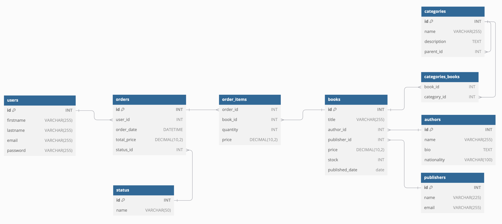

# Chapter One

## Introduction

The backoffice for Chapter One is a custom backoffice that is built with php and mysql. It is a simple backoffice that manage all tables in the database. The backoffice is setup to manage Books, Users, Orders and all their specific data and relations. The backoffice is build with a custom MVC structure and is build with the following technologies:

- PHP
- MySQL
- HTML
- CSS (Tailwind)
- Chart.js

In the project I've used partials to organize the code and make it more readable.

<br>

## Features

The backoffice has the following features:

- Dashboard with statistics
- Manage Books (Books, Authors, Publisheres & Categories)
- Manage Users (Orders & Statuses)
- Manage Orders
- File management

<br>

## Installation

Install the necessary packages via [composer](https://getcomposer.org/).

```
ddev composer install
```

To start the project, you can use the following command:

```
ddev start
```

The project is now running on the following URL:

```
https://127.0.0.1:6001
```

<br>

## Databasemodel

The database model is build with the following tables:



<br>

## License
This project is distributed under the [MIT License](LICENSE).


## Contact
If you have any questions or need further assistance, please feel free to contact me on LinkedIn or Instagram.

<a href="https://www.linkedin.com/in/meesakveld/"></a>
<a href="https://instagram.com/meesakveld"></a>